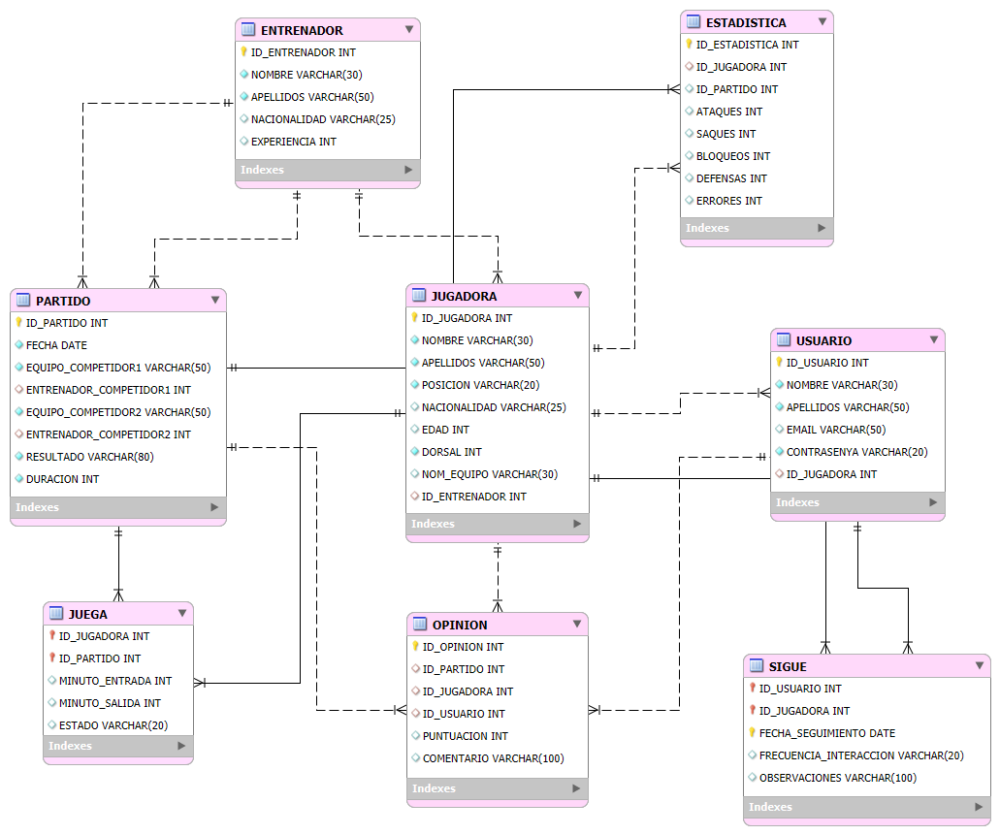

# 🏐 Gestión de Equipo de Voleibol

## Índice

* [Descripción del proyecto](#descripción-del-proyecto)
* [Objetivos](#objetivos)
* [Funcionalidades](#funcionalidades)
* [Modelo relacional](#modelo-relacional)
* [Stack tecnológico](#stack-tecnológico)
* [Instalación](#instalación)
  *  [Requisitos](#requisitos)
  * [Configuración](#configuración)
* [Estructura del proyecto](#-estructura-del-proyecto)
* [Licencia](#licencia)

---

## Descripción del proyecto
Aplicación Java realizada para la gestión de equipos, jugadoras y partidos de voleibol. Se conecta a **PostgreSQL** mediante **JDBC** utilizando el patrón **DAO** y permite registrar estadísticas, opiniones de fans y generar rankings de jugadoras más destacadas.

---

## Objetivos
- Aprender y aplicar el patrón **DAO** para acceso a datos.
- Practicar operaciones **CRUD** en Java conectadas a PostgreSQL.
- Implementar un **procedimiento almacenado** para ranking de jugadoras.
- Gestionar datos de jugadoras, entrenadores, usuarios en una estructura relacional.

---

## Funcionalidades
- Registro de **estadísticas** y asignación a jugadoras y partidos.
- Registro de **opiniones de fans** sobre jugadoras favoritas.
- Consulta de **ranking de jugadoras** según puntos.
- Gestión de seguimiento de jugadoras por usuarios.

## Modelo relacional


---

## Stack tecnológico

- **Backend:** Java 17, JDBC
- **Patrón de diseño:** DAO (Data Access Object)
- **Base de Datos:** PostgreSQL
- **Librerías:** Lombok, Log4j
- **Gestión:** Maven
- **Control de versiones:** Git y GitHub

---

## Instalación

### Requisitos
- Java 17+
- PostgreSQL 12+
- Maven 3.6+
- IDE (recomendado: IntelliJ IDEA o Eclipse)

### Configuración

1. **Clonar el repositorio:**
```bash
git clone https://github.com/DayanaraMontero/voley-management.git
cd voley-management
```

2. **Crear base de datos:**
```sql
CREATE DATABASE voleibol;
```

3. **Configurar application.properties:**
```properties
db.url=jdbc:postgresql://localhost:5432/voleibol
db.username=tu_usuario
db.password=tu_contraseña
```

4. **Compilar y ejecutar**

**Opción A - Con Maven:**

```bash
mvn clean install
mvn exec:java -Dexec.mainClass="Main"
```

**Opción B - Desde IDE:**

- Importar proyecto como proyecto **Maven**.
- Esperar a que descargue dependencias
- Ejecutar clase **Main.java**.

---

## Estructura del proyecto

```
voley-management/
├── src/
│   ├── main/
│   │   ├── java/
│   │   │   └── es/
│   │   │       └── cheste/
│   │   │           ├── clases/            # Clases: Jugadora, Entrenador, Usuario, Estadistica, Opinion, Juega, Sigue
│   │   │           ├── conexion/          # Conexión a PostgreSQL
│   │   │           ├── enums/             # Enumeraciones: EstadoJugadora, PosicionJugadora, FrecuenciaInteraccion
│   │   │           ├── excepcion/         # Excepciones personalizadas, ExcepcionDAO
│   │   │           ├── interfaces/        # Interfaces DAO
│   │   │           ├── impl/              # Implementación de interfaces DAO
│   │   │           ├── servicios/         # Lógica de negocio o servicios
│   │   │           └── Main.java          # Clase principal
│   │   └── resources/
│   │       ├── img/                       # Imágenes, en este caso modelo relacional
│   │       ├── sql/                       # Scripts SQL: procedimiento almacenado, crear/eliminar tablas
│   │       ├── application.properties     # Configuración de conexión a BD
│   │       └── log4j2.xml                 # Configuración del logging
├── .gitignore                             # Archivos ignorados por Git
├── app.log                                # Fichero de logs generado
├── pom.xml                                # Dependencias y configuración Maven
└── README.md                              # Este archivo
```

---

## Licencia
Proyecto desarrollado con fines educativos como parte del ciclo **Desarrollo de Aplicaciones Multiplataforna** en el **CIPFP Cheste, 2025.**

####  <u>*[Volver al índice](#índice)*</u>


